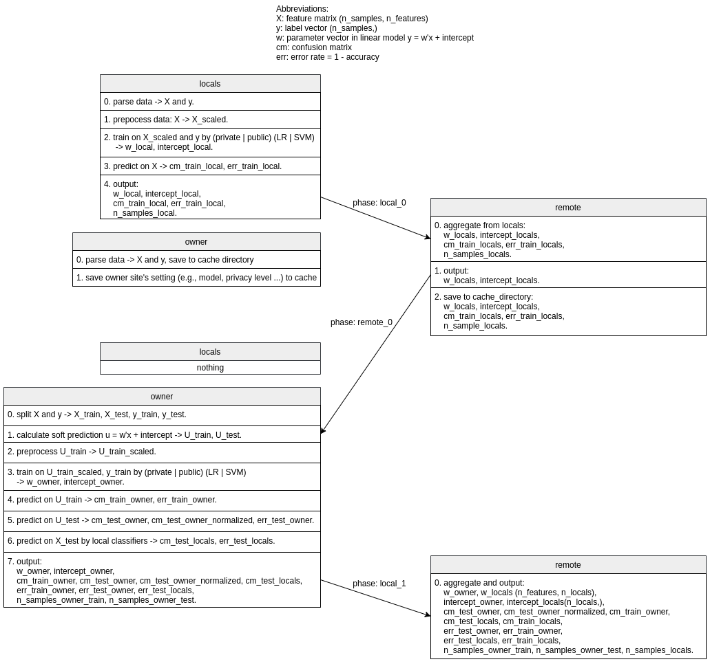

# COINSTAC_dpLR/SVM (for csv input)
COINSTAC implementation for differentially private L2-regularized Logistic Regression (LR) / Support Vector Machines (SVM)

Run a testing case: `./run.sh`. Data ([dpsvm_data](dpsvm_data)) and most of the setting ([inputspec.json](test/inputspec.json)) are documented in [[1]](#1). The owner site is *local0* in this case.

### 1. Overview
This package implements first training local binary classifiers (one at each local site) and then aggregating them to train an aggregator binary classifier (at the owner site), as illustrated in the following figure[[1]](#1): 

The local and aggregator classifiers are all tested on the testing data stored at the owner site. The performance is measured by confusion matrix and error rate (= 1 - accuracy). At both the owner and the local sites, the user can choose whether to build a **-differentially private** or **public** classifier and whether to use **LR** or **SVM** (using Huber loss) as the model. 

For the theoretical foundation and the algorithms of the differentially private LR and SVM, see [[2]](#2). Note we implemented the objective perturbation algorithm in [[3]](#3) instead of the one in [[2]](#2). 

### 2. Input
**Regularization parameter **: Highly depends on your data set. You might want to explore different settings. You can try logarithmically spaced first and then narrow it down within a range. You don’t want to over-tune , so don’t do a very exhaustive search. See section 6 in [[1]](#1) for detailed suggestions.

**Huber constant  for SVM**: Lies between 0 and 0.5. Setting it too close to zero leads to numerical instability, and we usually set it to be .

**Privacy parameter **: Try values from 0.1 to 1.5. Depending on the problem you may need to go higher. Larger value means lower privacy.

**Perturbation method**: When using differentially private models, choose "objective" (objective perturbation) or "output" (output perturbation).

**Fit_intercept**: Whether to calculate the intercept for the model. If set to false, intercept = 0 (i.e., the training data is expected to be already centered).

**Intercept_scaling**: When **fit_intercept** = true, sample vector x becomes [x, intercept_scaling], i.e., a “synthetic” feature is appended. The intercept becomes intercept_scaling * synthetic feature weight. Note the synthetic feature weight is subject to L2 regularization as all other features. To lessen the effect of regularization on synthetic feature weight (and therefore on the intercept) intercept_scaling has to be increased.

**Note**: 
- To use the differetially private version, n_samples, ,  and  must satisfy the following criterion:
), where  for LR and  for SVM. If , an exception will be raised [[2]](#2).
- When using the differentially private models, it is normal to see model coefficients and performance fluctuate at different runs with the same setting, since random noise is used in the differentially private algorithms. 

### 3. Code
The following diagram shows the framework implemented in [local.py](scripts/local.py) and [remote.py](scripts/remote.py).

### References
<a id="1">[1]</a> 
Sarwate, A. D., Plis, S. M., Turner, J. A., Arbabshirani, M. R., & Calhoun, V. D. (2014). Sharing privacy-sensitive access to neuroimaging and genetics data: a review and preliminary validation. Frontiers in neuroinformatics, 8, 35.

<a id="2">[2]</a> 
Chaudhuri, K., Monteleoni, C., & Sarwate, A. D. (2011). Differentially private empirical risk minimization. Journal of Machine Learning Research, 12(3).

<a id="3">[3]</a> 
 “Documentation for regularized lr and regularized svm code,” Available at http://cseweb.ucsd.edu/kamalika/code/dperm/documentation.pdf.      # coinstac-dpsvm-csv
